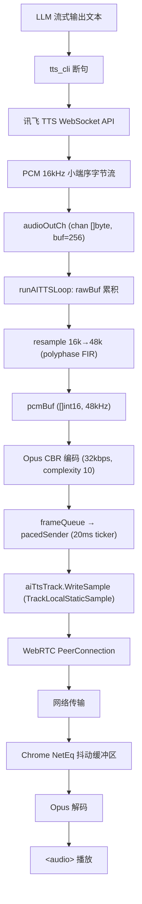
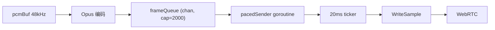

# TTS 合成语音 WebRTC 播放不完整：排查与修复案例

> **日期**：2026-07-26 ~ 2026-07-27
> **状态**：✅ 已解决 — 尝试 #21（Frame Pacing）确认有效
> **关联追踪**：[investigation-log.md](investigation-log.md)

---

## 一、问题概述

### 1.1 现象

LLM 回复文本经讯飞 TTS 合成为语音，通过 WebRTC 推送到浏览器播放时，**每句话只能听到开头几个字和末尾一段话，中间大部分完全丢失**。

典型 case（2026-07-27 19:42）：

| 项目 | 内容 |
|------|------|
| LLM 完整回复 | "这个嘛，我只是想逗你乐一下，哪真有钱送你啊！不过你这么说，我突然觉得自己好像还挺大方的，哈哈！要不咱一起做白日梦得了。" |
| 网页实际听到 | "这个" + "咱一起做白日梦得了" |
| 丢失部分 | 中间约 42 字 |
| 丢失比例 | ~85% |

此模式在每一句 LLM 回复中都稳定复现，不受句子长短影响。

### 1.2 影响范围

| 场景 | 状态 |
|------|------|
| 真人麦克风语音（用户间通话） | ✅ 正常，全程清晰完整 |
| TTS 合成语音（LLM 回复） | ❌ 只听到开头和末尾，中间丢失 |
| 音频清晰度（TTS 音质） | ✅ 已解决，能听清内容 |

### 1.3 问题定性

**一句话根因：TTS 合成速度远超实时播放速度，编码后的 Opus 帧在 tight loop 中瞬间全部发送，Chrome NetEq 抖动缓冲区溢出，中间帧被丢弃。**

---

## 二、系统背景：TTS 音频链路

### 2.1 完整数据流



### 2.2 与用户麦克风路径的关键差异

| 维度 | 用户麦克风 | TTS 合成语音 |
|------|-----------|-------------|
| 原始音频来源 | 浏览器麦克风采集 | 讯飞云 API 返回 |
| 采样率 | 浏览器原生（通常 48kHz） | 16kHz |
| 上采样 | 不需要 | 16k→48k FIR 重采样 |
| Opus 编码位置 | 浏览器端 | **SFU 服务端** |
| 发送速率 | 实时采集，天然 pacing | **批量合成，瞬间全部发送** ⚠️ |
| WebRTC track | 每用户独立 | `audio_ai_<clientID>` 独立 track |

**核心差异：发送速率**。用户麦克风是实时采集的，音频帧以自然速率（每 20ms 一帧）产生和发送。TTS 合成是批量完成的——5 秒音频可能 1 秒内合成完毕，如果没有 pacing，所有帧会在几毫秒内全部涌入 WebRTC 管道。

### 2.3 关键模块与文件

| 文件 | 职责 |
|------|------|
| `backend/sfu/sfu.go` | `runAITTSLoop`：TTS 音频主循环，PCM 累积、重采样、编码、发送 |
| `backend/sfu/audio_encoder.go` | Opus 编码器（`jj11hh/opus` WASM 原生 libopus） |
| `backend/sfu/audio.go` | 编码参数预设、PCM 工具函数 |
| `backend/tts_cli/service.go` | LLM 文本断句、送入 TTS 管道 |
| `backend/tts_cli/xfyun_synthesizer.go` | 讯飞 TTS WebSocket 合成 |
| `backend/tts_cli/provider.go` | SessionPipeline：句子通道 + 音频通道 |
| `frontend/src/hooks/useVoiceRoom.ts` | 浏览器端 ontrack 处理 |

---

## 三、排查时间线

本次排查历时两天，共 21 次代码尝试，跨越四个主要方向。最终在尝试 #21（Frame Pacing）找到根因。

### 阶段一：编码质量（尝试 #1 ~ #9）

**核心假设**：声音听不清是编码质量差导致的。

| 尝试 | 改动 | 结果 | 关键发现 |
|------|------|------|----------|
| #1 | Channels 0→2 | 无效 | SDP 参数不是根因 |
| #2 | CBR→VBR | **倒退**：尖锐爆鸣 | ccgo 编码器 VBR 路径损坏 |
| #3 | 引入 CGo 原生 libopus | 未验证 | Windows 无 opus-dev |
| #5 | 线性插值→polyphase FIR 重采样 | 无效 | 重采样不是瓶颈 |
| #6-#7 | 调整码率/复杂度/模式 | 无效 | ccgo 所有参数组合均无效 |
| **#8** | **ccgo→WASM 原生 libopus** | **✅ 清晰度解决** | 编码器替换是关键转折点 |
| #9 | 码率 32k→64k VBR | 小幅改善 | 但引入新问题：播放不完整 |

**阶段性结论**：WASM libopus（`jj11hh/opus`）解决了"听不清"，但暴露了"听不全"问题。

### 阶段二：数据丢失排查（尝试 #10 ~ #14）

**核心假设**：音频数据在管道某处被丢弃。

| 尝试 | 改动 | 结果 | 关键发现 |
|------|------|------|----------|
| #10 | CloseSentenceCh + 尾部刷新 | **倒退**：后续语音丢失 | pipeline 生命周期管理冲突 |
| #11 | select+timeout 替代 for-range | 待验证 | — |
| #12 | 批量重采样+禁止补零帧 | 无效 | 滤波器边界失真不是根因 |
| #13 | audioOutCh 缓冲 32→256 | 无效 | 排除 WS 阻塞假设 |
| **#14** | **goroutine 泄漏修复 + 三级诊断日志** | **✅ 诊断能力建立** | **字节记账确认零丢失** |

**#14 是关键里程碑**：日志证明管线中每个环节字节都对账——totalPCM、resampledBytes、framesEncoded 全部匹配。**数据没有丢，但浏览器就是听不到。** 问题不在"数据对不对"，而在"数据怎么发"。

### 阶段三：RTP 层排查（尝试 #15 ~ #20）

**核心假设**：RTP 时间戳不连续或 Marker 位缺失导致 Chrome NetEq 丢弃包。

| 尝试 | 改动 | 结果 | 关键发现 |
|------|------|------|----------|
| #15 | RTP 时间戳停顿补齐 | 无效 | 时间戳跳跃不是根因 |
| #16 | 按 talkspurt 设置 Marker 位 | 无效 | Marker 位也不是根因 |
| #17 | 迁移到 pion TrackLocalStaticSample | 无效 | RTP 层已排除 |
| #18 | 移除 resampler overlap 逻辑 | 无效 | resampler 已排除 |
| #19 | 64kbps VBR→32kbps CBR | 无效 | 码率/VBR 已排除 |
| #20 | 移除所有时间戳补偿 | 无效 | 时间戳已排除 |

**阶段性结论**：RTP 层（时间戳、Marker、Packetizer）、重采样层、编码参数层 **全部排除**。方向必须切换。

### 阶段四：发送速率（尝试 #21）

**核心假设**：数据没有丢、编码正确、RTP 封装正确——问题在于 **"怎么发"**。

尝试 #20 的结论第一次明确提出这个方向：

> "剩余方向：帧突发速率与 Chrome NetEq 缓冲区匹配——编码循环在 tight loop 中瞬间发送所有帧，讯飞合成速度可能远超实时，导致 NetEq 缓冲溢出丢弃。下一步应做帧发送节流（pacing）。"

这是排查思路的根本转变：从"改音频处理"转向"改发送行为"。

---

## 四、根因分析

### 4.1 Chrome NetEq 抖动缓冲区

Chrome 的 WebRTC 栈使用 NetEq 作为抖动缓冲区（jitter buffer），核心职责是：

1. **吸收网络抖动**：缓存若干帧，平滑到达时间波动
2. **按时交付解码**：以 20ms 为周期向解码器输出帧
3. **丢包补偿（PLC）**：帧未及时到达时，合成替代音频

NetEq 的缓冲区容量是有限的（通常 200~500ms）。正常情况下，发送端以实时速率（每 20ms 一帧）发送，接收端缓冲几帧后开始流畅播放。

### 4.2 帧突发场景

TTS 路径的实际行为：

```
时间线：
t=0.0s  LLM 开始回复，TTS 开始合成
t=1.0s  讯飞返回全部 5 秒音频（PCM 16kHz, ~160KB）
t=1.0s  runAITTSLoop 收到所有 chunk
t=1.0s  重采样完成：pcmBuf 含有 240000 samples (5s @ 48kHz)
t=1.0s  编码循环开始执行
t=1.0s  帧 0 ~ 帧 249 在几毫秒内全部 WriteSample
        ↓
        250 帧 Opus 瞬间涌入 WebRTC 管道
        ↓
        Chrome NetEq 收到帧突发
```

### 4.3 NetEq 缓冲区溢出过程

```
Chrome NetEq 缓冲区状态（容量 ~500ms = ~25 帧）：

[帧0-24] ← 前 500ms 填入缓冲区 ✅ 正常缓冲
[帧25-249] ← 后续帧到达时缓冲区已满
           → NetEq 判定：缓冲区溢出
           → 丢弃策略：丢弃最旧的未播放帧，为新帧腾空间
           → 结果：前几帧短暂播放后持续丢弃
           → 缓冲区始终处于"满→丢弃→满→丢弃"循环

t=5.0s  发送端突发结束，无新帧到达
t=5.0s  缓冲区开始排空
[帧247-249] ← 末尾几帧填入缓冲区 ✅ 正常播放
```

**这完美解释了"开头+末尾可听、中间全丢"的模式：**

```
完整句子："这个嘛，我只是想逗你乐一下...咱一起做白日梦得了。"
          ├─ 开头 2 字 ─┤├───── 中间 42 字全丢 ─────┤├── 末尾 8 字 ──┤
NetEq:    [填缓冲→播放]   [缓冲满→持续丢弃中间帧]      [突发结束→排空→播放]
```

### 4.4 为什么真人语音不受影响

用户麦克风路径是**实时采集**：浏览器每 20ms 采集一帧 → Opus 编码 → 发送。帧之间自然间隔 20ms，NetEq 缓冲区永远不会溢出。

```
麦克风路径：帧0──20ms──帧1──20ms──帧2──20ms──帧3──...  ✅ 天然 pacing
TTS 路径：  帧0帧1帧2...帧249 在同一毫秒内全部到达       ❌ 无 pacing
```

### 4.5 为什么之前 20 次都找错方向

反思排查过程中的认知陷阱：

1. **"字节零丢失"的误导**：诊断日志显示所有字节都对账，让人坚信问题在编码/RTP 层的"正确性"，而非发送层的"行为"
2. **关注"数据对不对"而非"发送快不快"**：RTP 时间戳、Marker 位、采样率、码率——这些都是数据层面的问题。但根因是时序层面的
3. **真人语音正常的对比盲区**：两支路径差异点很多（采样率、编码位置），但关键的"pacing"差异被忽视
4. **Chrome NetEq 黑盒**：没有第一时间用 `chrome://webrtc-internals` 查看浏览器端丢包统计

---

## 五、解决方案：Frame Pacing

### 5.1 设计思路

将编码与发送解耦：
- **编码层**：快速编码所有帧，放入缓冲队列（不阻塞 TTS 管道）
- **发送层**：独立 goroutine，以 20ms ticker 精确控制发送速率



### 5.2 关键代码结构

```go
// 帧队列：容量 2000 = 40 秒缓冲
type queuedFrame struct {
    payload []byte
}
frameQueue := make(chan queuedFrame, 2000)

// pacedSender：以实时速率从队列取帧发送
senderDone := make(chan struct{})
go func() {
    defer close(senderDone)
    ticker := time.NewTicker(20 * time.Millisecond)
    defer ticker.Stop()
    for {
        select {
        case <-ticker.C:
            select {
            case qf, ok := <-frameQueue:
                if !ok { return } // 队列已关闭，排空完成
                aiTtsTrack.WriteSample(media.Sample{
                    Data:     qf.payload,
                    Duration: 20 * time.Millisecond,
                })
                // relay 给其他客户端...
            default:
                // 队列为空，跳过本次 tick
            }
        }
    }
}()

// 编码循环：帧入队（不再直接发送）
for len(pcmBuf) >= opusEncoderFrameSamples {
    frame := pcmBuf[:960]
    pcmBuf = pcmBuf[960:]
    opusPayload, _ := enc.Encode(frame)
    frameQueue <- queuedFrame{payload: opusPayload}
}

// 退出时：排空残帧 → 关闭编码器 → 关闭队列 → 等待排空
close(frameQueue)
<-senderDone
```

### 5.3 参数选择

| 参数 | 值 | 依据 |
|------|-----|------|
| pacing 间隔 | 20ms | Opus 帧时长（960 samples @ 48kHz = 20ms），匹配实时播放速率 |
| frameQueue 容量 | 2000（40s） | 最长 LLM 回复约 10~15 秒，留足余量 |
| ticker 精度 | `time.NewTicker` | Windows 下 ~1ms 精度，对 20ms 间隔足够 |

### 5.4 为什么这样设计

- **不阻塞编码循环**：编码入队只需一次 channel send，不影响 select 主循环对其他事件的响应（数据到达、超时刷新、周期诊断）
- **发送速率精确匹配播放**：20ms ticker 保证发送速率不超实时，NetEq 缓冲区不会溢出
- **退出安全**：先关闭编码器（无新帧）→ 关闭队列（通知 sender）→ 等待排空（所有帧发送完毕）

---

## 六、经验教训

### 6.1 排查方法论

1. **字节记账先行**：在每个处理环节插入计数器（totalPCM、resampledBytes、framesEncoded），快速确认数据是否丢失。这是隔离"上游问题"和"下游问题"的关键一步
2. **隔离变量**：每次只改一个方向。本次排查中，尝试 #14 先建立诊断能力（不改变量），再逐一验证假设
3. **从数据到行为**：当"数据正确性"排查走到死胡同时，及时切换到"时序/行为"视角。`chrome://webrtc-internals` 的丢包统计是重要的外部视角
4. **成熟库优先**：ccgo→WASM libopus 和手写线性插值→polyphase FIR 都验证了这一点

### 6.2 技术认知

1. **WebRTC 流式播放预生成音频必须 pacing**：这是本次最核心的认知。任何"先批量化生成、再推入 WebRTC"的路径都需要控制发送速率
2. **NetEq 是黑盒但行为可预测**：缓冲区溢出导致的"首尾可听、中间丢失"是一个可识别的 pattern
3. **RTP 时间戳 ≠ 发送速率控制**：RTP 时间戳是媒体时间戳，控制播放时序；发送速率是 wall clock 行为，由应用层控制。两者独立

### 6.3 后续改进

1. 在生产代码中保留 `chrome://webrtc-internals` 可观测性——它是排查浏览器端音频问题的最强工具
2. 在 PCM dump 基础上，可增加编码后 Opus dump，方便隔离验证编码器行为
3. 如果 pacing 有效，可进一步将 `frameQueue` 容量从固定值改为可动态调整，适应不同 TTS 语速

---

## 七、附录

### 7.1 修改文件列表（尝试 #21）

| 文件 | 改动 |
|------|------|
| `backend/sfu/sfu.go` | `runAITTSLoop`：新增 frameQueue + pacedSender goroutine；编码循环入队替代直接发送；audioLoopDone 排空逻辑 |

### 7.2 验证方法

| 方法 | 用途 |
|------|------|
| `ffplay -f s16le -ar 16000 -ac 1 tts_dump_*.pcm` | 验证讯飞返回的原始 PCM 是否完整 |
| `chrome://webrtc-internals` → 选中 PeerConnection → `audioInbound` | 查看浏览器端实际丢包率、jitter buffer 延迟 |
| 后端日志 `TTS 周期诊断`（每 10s） | 观察 totalPCM/framesEncoded/pcmBufLag |
| 后端日志 `TTS 音频流结束` | 汇总统计 totalPCM/resampledBytes/framesEncoded |

### 7.3 参考资源

| 资源 | 链接 | 说明 |
|------|------|------|
| Opus 官方 | https://opus-codec.org/docs/ | RFC 6716，编码参数建议 |
| pion/webrtc | https://github.com/pion/webrtc | Go WebRTC 实现，TrackLocalStaticSample |
| gunter-q12/resample | https://github.com/gunter-q12/resample | 纯 Go polyphase FIR 重采样 |
| jj11hh/opus | https://github.com/jj11hh/opus | WASM 原生 libopus（wazero 运行时） |
| 讯飞 TTS API | https://www.xfyun.cn/doc/tts/online_tts/API.html | WebSocket 协议，PCM 16kHz 输出 |
| Chrome WebRTC Internals | `chrome://webrtc-internals` | 浏览器端 WebRTC 诊断面板 |

### 7.4 排查尝试全记录

详见 [investigation-log.md](investigation-log.md)，包含全部 21 次尝试的详细信息。
